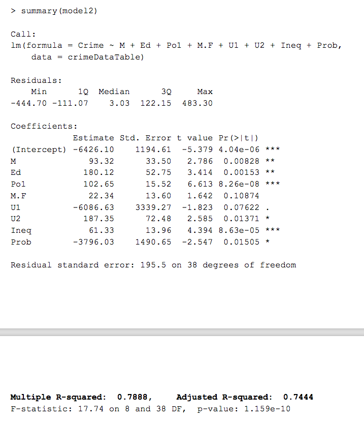

```{r setup, include=FALSE}
knitr::opts_chunk$set(echo = TRUE)
```

### Objectives

The first area of focus of Week4's homework is Principal Component Analysis and comparing that with other models like linear regression with manual predictor selection (question 8.2 from last homework). It then builds on top of that by applying regression trees and random forests to show how the results get more accurate and sharpened (albeit not as explainable). Finally it wraps up looking at logistic regression, and measurement of cost using the confusion matrix principles


```{r preRequisites, echo=FALSE, message=FALSE, warning=FALSE}
# installing packages if needed
if("ggplot2" %in% rownames(installed.packages()) == FALSE) {install.packages("ggplot2")}
#if("grid" %in% rownames(installed.packages()) == FALSE) {install.packages("grid")}
#if("gridExtra" %in% rownames(installed.packages()) == FALSE) {install.packages("gridExtra")}
#if("gtools" %in% rownames(installed.packages()) == FALSE) {install.packages("gtools")}
#if("reshape" %in% rownames(installed.packages()) == FALSE) {install.packages("reshape")}
if("purrr" %in% rownames(installed.packages()) == FALSE) {install.packages("purrr")}
if("factoextra" %in% rownames(installed.packages()) == FALSE) {install.packages("factoextra")}
if("tree" %in% rownames(installed.packages()) == FALSE) {install.packages("tree")}
if("rpart" %in% rownames(installed.packages()) == FALSE) {install.packages("rpart")}
if("randomForest" %in% rownames(installed.packages()) == FALSE) {install.packages("randomForest")}
if("rms" %in% rownames(installed.packages()) == FALSE) {install.packages("rms")}
if("caret" %in% rownames(installed.packages()) == FALSE) {install.packages("caret")}
if("e1071" %in% rownames(installed.packages()) == FALSE) {install.packages("e1071")}
if("treeClust" %in% rownames(installed.packages()) == FALSE) {install.packages("treeClust")}
if("ROCR" %in% rownames(installed.packages()) == FALSE) {install.packages("ROCR")}

# loading libraries
rm(list = ls())
library(ggplot2)
#library(grid)
#library(gridExtra)
#library(gtools)
#library(reshape)
library(purrr)
library(factoextra)
library(tree)
library(rpart)
library(rpart.plot)
library(randomForest)
library(rms)
library(caret)
library(e1071)
library(treeClust)
library(ROCR)

```


####Question 9.1

**Using the same crime data set uscrime.txt as in Question 8.2, apply Principal Component Analysis and then create a regression model using the first few principal components. Specify your new model in terms of the original variables (not the principal components), and compare its quality to that of your solution to Question 8.2.ould you need? Would you expect the value of alpha (the first smoothing parameter) to be closer to 0 or 1, and why?**


Some other tips from the question:

- You can use the R function prcomp for PCA. 
- Note that to first scale the data, you can include scale. = TRUE to scale as part of the PCA function. Don’t forget that, to make a prediction for the new city, you’ll need to unscale the coefficients (i.e., do the scaling calculation in reverse)!)
- First we download and load the data

```{r loadData-9.1, echo=TRUE, message=FALSE, warning=FALSE}

dataFile <- "uscrime.txt"
if (!file.exists(dataFile)) {
  crimeDataURL <- paste0(c("http://www.statsci.org/data/general/uscrime.txt"))
  download.file(crimeDataURL, dataFile) }

crimeDataTable <- read.table(dataFile, header = TRUE )

```

- Then, we apply the prcomp formula on the predictors, and print the summary:

```{r apply-prconf-9.1, echo=TRUE}

#pcaModel <- prcomp( ~ crimeDataTable[,1:15] , scale. = TRUE)
# note, the tilda didn't work, so you shove the numeric data (x per man page directly, like so:

pcaModel2 <- prcomp(crimeDataTable[,1:15] ,  scale. = TRUE)

summary(pcaModel2)
```

- some PCAs have higher variance than others, aka higher data spread (recall D1 dimension in lectures)
- these are the more important PCs, and have been ranked by the model as such. (by proportion of variance)
- now we create a NEW table, with the new Principal components and append crime , and then run regression on it:


```{r createNewDFandRunRegressionOnIt-9.1, echo=TRUE}

CrimeDataWithPrincipalComponents <- as.data.frame(cbind(pcaModel2$x, crimeDataTable[,16]))
cn <- colnames(CrimeDataWithPrincipalComponents)
cn[16] <- "Crime"
colnames(CrimeDataWithPrincipalComponents)  <- cn

# running reg:
RegressionModelBasedonPCs <- lm(Crime ~ . , data = CrimeDataWithPrincipalComponents)
# TA used the command below, but I checked. both yield same output, and mine is cleaner
#RegressionModelBasedonPCs2 <- lm(CrimeDataWithPrincipalComponents[,16]~. , data = CrimeDataWithPrincipalComponents[,1:15])                                          


```


- let's check out the specifics around this regression model:

```{r printSummaryRegression-9.1, echo=TRUE}

summary(RegressionModelBasedonPCs)

```

Observations:

- exceptionally low p-value (which is good, shows this model is accurate)
- adjusted r-squared is 70.78%, very good, however looking at the probability column for each PCA, the question is, could this be because of over-fitting?. Specifically
  - only Intercept, PC1, PC2, PC5 and PC12 have *** , however look at the probabilities. virtually all components except PC9, PC10, and PC11 and PC13 are less then 0.25 probability. those 4 have .61, .56, .42, .68 respectively
- so, let's drop those few from the model 


```{r cleaningUPThePCAModel-9.1, echo=TRUE}
RegressionModelBasedonPCs_SHARPER <- lm(Crime ~ PC1+PC2+PC3+PC4+PC5+PC6+PC7+PC8+PC12+PC14+PC15, data = CrimeDataWithPrincipalComponents)
summary(RegressionModelBasedonPCs_SHARPER)

```

- our r squared eeked out better this time (73%) and p-value got smaller by a magnitude of 100! (from 10^-7 to 10^-9)
- this model is a keeper.
- however there is another way to select the appropriate principal values, aka the ELBOW diagram
- luckily the library `factoextra` has a function which can do just this!


```{r AndConvertingBackToOriginalModel-9.1, echo=TRUE}

fviz_eig(pcaModel2)

```

- this shows that the first 5 dimensions aka, principal components explain about 87% of the variance, and thus are the most relevant to the model, after which there is likely overfitting going on.
- another way to depict this (courtesy of Matt Nguyen on the slack channel) is using the pretty `ggplot` graph, which yields the same answer.


```{r graphOfVarianceMattCode-9.1, echo=TRUE}

pcaVariance <- as.data.frame(summary(pcaModel2)$importance[3,])
PC <- 1:15
ggplot(pcaVariance, aes(x = factor(PC), y = pcaVariance, fill = factor(PC))) + geom_col() +
  labs(title = 'Cumulative Variance Accounted',
       subtitle = 'Additive Sum of Prior PCs',
       x = 'Principal components',
       y = 'Variance Accounted',
       fill = 'PC')

```


- another interesting view from the `factoextra` library is the graph of variables and their direction on correlation
  -  Positive correlated variables point to the same side of the plot. 
  - Negative correlated variables point to opposite sides of the graph.


```{r graphOfVars-9.1, echo=TRUE}

fviz_pca_var(pcaModel2, col.var = "contrib", repel = "TRUE")

```
  
  
- therefore, choosing the linear model based on the first 5 Principal components:


```{r linModel-9.1, echo=TRUE}

RegressionModelBasedonPCs_FINAL <- lm(Crime ~ PC1+PC2+PC3+PC4+PC5, data = CrimeDataWithPrincipalComponents)
summary(RegressionModelBasedonPCs_FINAL)
```

- yes, the adjusted r square is lower now (60%) but these are the best PCs per the expained variances graph
- (what I cannot explain is the Prob of PC3 being .32)


- let's first multiply with the pcaModel2$rotation matrix to bring it back to original dimensions, and print the scaled coefficients:

```{r rotateBack-9.1, echo=TRUE}
RegCoefficientsForTop5PCs <- RegressionModelBasedonPCs_FINAL$coefficients[2:length(RegressionModelBasedonPCs_FINAL$coefficients)]

ScaledFinalCoefficients <- RegCoefficientsForTop5PCs %*%head(t(pcaModel2$rotation), 5)

ScaledFinalCoefficients

```

- now we unscale them back and print the output. This is the final output of our regression model.
- note: i'm assuming that the SCALED = true command used standard normalization theory, which is:
x(normalized)  = (x(real) - mean)  / (standard.deviation)
- so the unscaling part is really doing everything in reverse, meaning:
x(real) = x(normalized)*(std.dev) + mean

```{r unscaleData-9.1, echo=TRUE}

RegCoefficientsForTop5PCs <- RegressionModelBasedonPCs_FINAL$coefficients[2:length(RegressionModelBasedonPCs_FINAL$coefficients)]

ScaledFinalCoefficients <- RegCoefficientsForTop5PCs %*%head(t(pcaModel2$rotation), 5)

#ScaledFinalCoefficients


meanForEachPredictor <- map_dbl(crimeDataTable[,1:15], mean)
standardDeviationForEachPredictor <- map_dbl(crimeDataTable[, 1:15], sd)

FinalCoefficients_Unscaled <- ScaledFinalCoefficients*standardDeviationForEachPredictor + meanForEachPredictor

print("Final, Unscaled coefficients")
FinalCoefficients_Unscaled
```

- final comments on the quality. this was the model from q8.2 (hw3) with a quality of 70% r squared
- the final formula used there was 8 predictors: formula = Crime ~ M + Ed + Po1 + M.F + U1 + U2 + Ineq + Prob



- clearly our models quality from the pca metrics is only 60.6% of R squared if you scroll above, but we removed a lot of overfitting in the process
- our model does spit out all 15 predictors I was assuming the coefficients would have reduced the weighting for the useless predictors, but looking at the unscaled coefficients, none of them are tiny. so looks like our model is using all 15 predictors in play. which is not a bad thing per se. I was just expecting the coefficients of atleast the 8 predictors we had selected in Q8.2 in HW3 would have been much lower..

- components derived from PCA come back in FULL force for all 15 components, if none of them is tiny (say scale of 10^-3) then model thinks each of them is germane to the prediction. That pretty much guarantees that the PCA model is over fitting.

**Reference:  a useful article explaining all the tips around scaling/centering etc:**


LINK: [PCA using prcomp and factoextra packages](http://www.sthda.com/english/articles/31-principal-component-methods-in-r-practical-guide/118-principal-component-analysis-in-r-prcomp-vs-princomp/)


------

####Question 10.1	

**Using the same crime data set uscrime.txt as in Questions 8.2 and 9.1, find the best model you can using**
**(a) a regression tree model, and**
**(b) a random forest model.[...] don’t just stop when you have a good model, but interpret it too**


#####10.1a (regression tree)

- break the data apart from training and test


```{r splitData-10.1, echo=TRUE, message=FALSE, warning=FALSE}
set.seed(1) 
crimeDataTrainingIndices <- sample(nrow(crimeDataTable), size = floor(nrow(crimeDataTable)*0.7))
crimeDataTraining <- crimeDataTable[crimeDataTrainingIndices,]

# will split the remaining 30% into validation and testing data sets
restOfData <- crimeDataTable[-crimeDataTrainingIndices,]
crimeDataTesting <- restOfData[1:floor(nrow(restOfData)),]
#crimeDataTesting <- restOfData[ceiling(nrow(restOfData)*0.5):nrow(restOfData),]
```


- First we fit the regression tree function to the _training_ crime data, essentially growing the tree based on recursive partitioning (big boy words taken from man page)

```{r treeAndForest-10.1, echo=TRUE, message=FALSE, warning=FALSE}
#treeData <- tree(Crime~., data = crimeDataTraining)
#summary(treeData)

treeDataFromRPart_JustTrainingData <- rpart(Crime~., data = crimeDataTraining)
rpart.plot(treeDataFromRPart_JustTrainingData)

```


- this table looks pretty sparse, and I suspect we lose valuable information by splitting like this
- However, since for this homework, the TAs are ok with splitting this sparse data so we can test the model with clean, independent data.
- the output above shows that the variables used are Po1, POP, LF, and NW:
  - Po1   per capita expenditure on police protection in 1960. If its greater than 8.1M its classified separately vs when its less
  - Pop   state population in 1960 in hundred thousands

- going back to the training data
```{r treeInterpret-10.1, echo=TRUE, message=FALSE, warning=FALSE}
treeDataFromRPart_JustTrainingData$frame
```

- we are interested in leaf #4, leaf #5 and leaf #3
- lets now iterate through each branch of the tree and run linear regression on each to identify a good model
- we use the rpart.predict.leaves to cleanly separate the data for each leaf. this is part of the treeClust package

```{r splitLeaves-10.1, echo=TRUE, message=FALSE, warning=FALSE}

leaves <- rpart.predict.leaves(treeDataFromRPart_JustTrainingData, crimeDataTraining, type = "where" )

leaf4 <- vector()
leaf5 <- vector()
leaf3 <- vector()

for (valueWithinLeaf in 1:length(leaves)) {
  
  # figuring this out took really long!!!
  if(leaves[[valueWithinLeaf]] == 4) { leaf4 <- c(leaf4, valueWithinLeaf) }
  if(leaves[[valueWithinLeaf]] == 5) { leaf5 <- c(leaf5, valueWithinLeaf) }
  if(leaves[[valueWithinLeaf]] == 3) { leaf3 <- c(leaf3, valueWithinLeaf) }

}

```

- now that we have split the leaves out, we run the lm function on them:
```{r runLMonLeaves-10.1, echo=TRUE, message=FALSE, warning=FALSE}
leaf3LinearModel <- lm(Crime ~ ., data = crimeDataTraining[leaf3,])
leaf4LinearModel <- lm(Crime ~ ., data = crimeDataTraining[leaf4,])
leaf5LinearModel <- lm(Crime ~ ., data = crimeDataTraining[leaf5,])
```


- lets get a result of predicted responses from a fitted rpart object
```{r predictedResp-10.1, echo=TRUE, message=FALSE, warning=FALSE}

predictedCrimeRatesLeaf3 <- predict(leaf3LinearModel, crimeDataTesting[,1:15], type = "response")
predictedCrimeRatesLeaf4 <- predict(leaf4LinearModel, crimeDataTesting[,1:15], type = "response")
predictedCrimeRatesLeaf5 <- predict(leaf4LinearModel, crimeDataTesting[,1:15], type = "response")


#predict(treeDataFromRPart_JustTrainingData, crimeDataTraining[,1:15], type = "vector")
#predictedCrimeRates
```

- lets compare the actual vs predicted data (I started to normalize this data, but realized there is no value in doing that since we are just evaluating the Crime parameter so there is no other scale to contend with)
```{r comparePredAndReal-10.1, echo=TRUE, message=FALSE, warning=FALSE}

#meanForCrime <- mean(crimeDataTable$Crime)
#sdForCrime <- sd(crimeDataTable$Crime)
#normalizedPredictedCrimeRates <- (predictedCrimeRates - meanForCrime)/ sdForCrime

differenceInPredictedAndActualInPercentage_leaf3 <- (predictedCrimeRatesLeaf3 - crimeDataTesting$Crime)/crimeDataTesting$Crime

errorPercentageForLeaf3 <- mean(abs(differenceInPredictedAndActualInPercentage_leaf3))
cat("The error % between predicted and real (testing) data for leaf3 is", errorPercentageForLeaf3, "\n")

differenceInPredictedAndActualInPercentage_leaf4 <- (predictedCrimeRatesLeaf4 - crimeDataTesting$Crime)/crimeDataTesting$Crime

errorPercentageForLeaf4 <- mean(abs(differenceInPredictedAndActualInPercentage_leaf4))

cat("The error % between predicted and real (testing) data for leaf4 is", errorPercentageForLeaf4, "\n")


differenceInPredictedAndActualInPercentage_leaf5 <- (predictedCrimeRatesLeaf5 - crimeDataTesting$Crime)/crimeDataTesting$Crime

errorPercentageForLeaf5 <- mean(abs(differenceInPredictedAndActualInPercentage_leaf5))

cat("The error % between predicted and real (testing) data for leaf5 is", errorPercentageForLeaf5, "\n")


```

- essentially 21% is the average difference of each predicted vs actual crime value using the tree method.

- now let's run the random forest: (i use the type = "response" here )
**If object$type is classification, the object returned depends on the argument type:**
**response	 - predicted classes (the classes with majority vote).**


```{r Forest-10.1, echo=TRUE, message=FALSE, warning=FALSE}

numberOfPredictorsToConsider <- 4
randomForestData <- randomForest(Crime ~. , data = crimeDataTable, mtry = numberOfPredictorsToConsider, importance = TRUE)

predictedCrimeRatesUsingForest <- predict(randomForestData, crimeDataTable[,1:15], type = "response")

predictedCrimeRatesUsingForest
```

- now let's compare predicted vs real for the forest output:

```{r comparePredAndRealForest-10.1, echo=TRUE, message=FALSE, warning=FALSE}

# meanForCrime <- mean(crimeDataTable$Crime)
#sdForCrime <- sd(crimeDataTable$Crime)

#normalizedPredictedCrimeRates <- (predictedCrimeRates - meanForCrime)/ sdForCrime

differenceInPredictedAndActualInPercentage_FOREST <- (predictedCrimeRatesUsingForest - crimeDataTable$Crime)/crimeDataTable$Crime

mean(abs(differenceInPredictedAndActualInPercentage_FOREST))

``` 


- essentially 10% is the average difference of each predicted vs actual crime value using the tree method.

- so clearly the random forest method does a better job in prediction (10% vs 21%) than the solitary tree method.

------

####Question 10.2
**Describe a situation or problem from your job, everyday life, current events, etc., for which a logistic regression model would be appropriate. List some (up to 5) predictors that you might use.**

The whole value of logistic regression is the ability to predict the PROBABILITY of an event happen . The event result is also binary furthermore. Meaning, either it will happen or it won't happen. I would apply this in my startup context as follows:

I am a co-founder of waada (http://waada.org). The purpose of this non profit is to help folks with mental illness using technology.  The reason why CUSUM / Change Detection is so germane to this organization is that I can can use the CUSUM algorithm to detect mood changes. Unless the person has bi-polar depression , where the changes are obvious, depression in people who are prone to it creeps in gradually until its too late for the care giver to make an impact. In this situation, the "slippery slope" hits the depressed person and they stay depressed for weeks or months. Sometimes crude measures like medicine have to be taken to lift them out, but those are mostly artificial and there is no way to measure the exact quantity to be taken by the person to get better since measuring the "extent" of depression is so subjective. Therefore there is almost always a slight overdose of the medicine, which in the long term is severely adverse to the health of the patient, since he or she invariably becomes dependent on that medicine, akin to a drug addict.

The concept I have is as follows. Suppose we are able to take in physiological information (heartbeats through fitbits or iWatch wearables), phone mobility (through its gyroscope), # of calls made, length of calls, we can start creating a pattern around this person. We can also allow this person to directly enter into the phone via an app if they are feeling down or not (taking care to give something back in return, like a calming remedy , a song, breathing techniques etc so we can motivate the person to enter the data). I would take the input from each of these predictors, and calculate via logistic regression a way to detect the probability that a person has fallen into depression so that remedial actions can be taken for immediate efficacy.

Prompt identification of the onset of depression would allow us to engage in proactive measures like involving the caregiver much sooner, or providing special services through the mobile app around improving breathing techniques and a more engaged package of activities. if the onset is pretty severe, healthcare and even emergency services (suicide hotline) could be put on notice.


------

####Question 10.3.1
**Using the GermanCredit data set use logistic regression to find a good predictive model for whether credit applicants are good credit risks or not. **
**- Show your model (factors used and their coefficients), **
**- the software output, and**
**- the quality of fit.**


```{r germanData-10.3, echo=TRUE, message=FALSE, warning=FALSE}

dataFile <- "germancredit.txt"
if (!file.exists(dataFile)) {
  germanCreditURL <- paste0(c("https://prod-edxapp.edx-cdn.org/assets/courseware/v1/a145a478beb6f64b59ec1de082b84235/asset-v1:GTx+ISYE6501x+2T2018+type@asset+block/10.3germancreditSummer2018.txt"))
  download.file(germanCreditURL, dataFile) }

germanCreditTable <- read.table(dataFile, header = FALSE )

# changing the response variabl to 0 or 1 since glm binomial will be expecting that...
germanCreditTable$V21[germanCreditTable$V21 == 1] <- 0
germanCreditTable$V21[germanCreditTable$V21 == 2] <- 1

```
- use the legend here to undersand this data: http://archive.ics.uci.edu/ml/datasets/Statlog+%28German+Credit+Data%29
- first we use the glm model...
```{r runningGLM-10.3, echo=TRUE, message=FALSE, warning=FALSE}

logisticRegModel <- glm(V21 ~ . , family = binomial(link = "logit"), data = germanCreditTable)

summary(logisticRegModel)
```

- the above are way too many coefficients, and GLM doesn't give r squared either 
- recall Dr Sokol's lecture that R sq is not really possible for Logistic regression
- searching on the net, found them rms (heavy) package which provides a pseudo quality of fit
- first we carve the data out to training and test data, train the model using the former

```{r createLogitModel-10.3, echo=TRUE, message=FALSE, warning=FALSE}

set.seed(1) 
germanDataTrainingIndices <- sample(nrow(germanCreditTable), size = floor(nrow(germanCreditTable)*0.7))
germanDataTraining <- germanCreditTable[germanDataTrainingIndices,]

# will split the remaining 30% into validation and testing data sets
restOfData <- germanCreditTable[-germanDataTrainingIndices,]
germanDataTesting <- restOfData[1:floor(nrow(restOfData)),]
#crimeDataTesting <- restOfData[ceiling(nrow(restOfData)*0.5):nrow(restOfData),]

fitlogisticRegModel_RMS <- lrm(V21 ~ . ,  data = germanDataTraining)

print(fitlogisticRegModel_RMS)
```

- as we can see above the R^2 computed is ~ 44.7% only. this model is not a great quality of fit.


------

####Question 10.3.2
**Because the model gives a result between 0 and 1, it requires setting a threshold probability to separate between “good” and “bad” answers. In this data set, they estimate that incorrectly identifying a bad customer as good, is 5 times worse than incorrectly classifying a good customer as bad. Determine a good threshold probability based on your model.**


From the data set details:
This dataset requires use of a cost matrix (see below) 

..... 1 2 
---------------------------- 
1 0 1 
----------------------- 
2 5 0 

(1 = Good, 2 = Bad) 

The rows represent the actual classification and the columns the predicted classification. 

It is worse to class a customer as good when they are bad (5), than it is to class a customer as bad when they are good (1). 


- now we calculate the confusion matrix, and plot it:


```{r confusionMatrixCalc-10.3, echo=TRUE, message=FALSE, warning=FALSE}

predictedGermanCreditResult_TESTDATA <- predict(fitlogisticRegModel_RMS, germanDataTesting[, 1:20])

probs <- round(exp(predictedGermanCreditResult_TESTDATA)/(1+exp(predictedGermanCreditResult_TESTDATA)))

cMatrix <- confusionMatrix(
  factor(probs),
  factor(germanDataTesting[, 21])
)
cMatrix$table
TP <- cMatrix$table[1,1]
FP <- cMatrix$table[1,2]
FN <- cMatrix$table[2,1]
TN <- cMatrix$table[2,2]

fourfoldplot(cMatrix$table)
```


- incorrectly identifying a bad customer as good (FP) is 5x WORSE than identirying a good customer as bad (TN)
- there is 0 cost identifying a bad customer as bad (FN) and good customer as good (TP)

- just an example to read this FP, FN mumbo jumbo:
- FP = false positive, meaning the model thinks is positive, or a good customer, but in reality its false, i.e. , its a bad customer

- therefore the overall cost is calculated as:
```{r calcCost-10.3, echo=TRUE, message=FALSE, warning=FALSE}

Cost <- 0*TP + 1*TN + 0*FN + 5*FP

Cost
```

- to figure out the cutoff, I used the ROCR package (as per a piazza post):

```{r usingROCR-10.3, echo=TRUE, message=FALSE, warning=FALSE}


pred <- prediction(probs,germanDataTesting[, 21])
cost.perf = performance(pred, "cost")
#pred@cutoffs[[1]][which.min(cost.perf@y.values[[1]])]

cost.perf@y.values

```

- from the result we can see that the minimum cost is 0.2633. that is what i'd set as the threshold